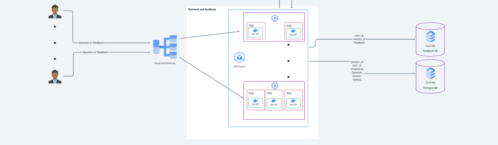

# 🤖 Bot Specialist

This bot is built entirely on Generative AI technology and the Retrieval-Augmented Generation (RAG) technique. Developed in the cloud, it ensures a flexible, scalable architecture while following best practices for CI/CD.

The application is designed to provide fast access to information and allows users to verify the answers it generates. Acting as a "second brain," the bot processes and stores knowledge from uploaded PDF files. Once a file is added and processed, users can ask any questions related to its content and receive accurate, AI-powered responses.

---

## ✏️ Architecture

This repository is part of the following architecture:



### Components:

- **Bot API** (This repository)
- **Doc Ingestion Pipeline** (You can find it in this [link](https://github.com/lucasvittal2/doc_ingestion_pipeline/tree/dev))

The image below illustrates in more detail how the API is structured:


---

## 🚀 Getting Started

### 📋 Prerequisites
Before getting started, ensure you have the following prerequisites:

- Python 3.9 installed
- macOS or Linux operating system
- Google Cloud account with billing enabled
- Cloud Run and Vertex AI APIs enabled on GCP
- Terraform installed locally
- Docker installed locally

### 🏃 Setup & Deployment
Once all prerequisites are met:

1. **Initialize the project**
   ```shell
   make init
   ```

2. **Provision the required resources**
   ```shell
   .github/bootstrap/provisioning.sh \
     --env  <ENV> \
     --mode "CREATE" \
     --python-container-image "python:3.9" \
     --registry-repo-name  <REGISTRY_REPOSITORY_NAME> \
     --container-image "<YOUR-REGION>-docker.pkg.dev/<PROJECT_ID>/<REGISTRY_REPOSITORY_NAME>/doc-ingestion-pipeline-dev:v1" \
     --project-id "<PROJECT_ID>"
   ```
   ⚠️ **Don't forget to replace placeholders with your actual values.**

3. Once provisioning is complete, you will receive a URL like:
   ```text
   https://bot-api-150030916493.us-east1.run.app
   ```
   Keep this base URL safe, as you'll need it to consume the API.

---

## 🌐 Consuming the API

⚠️ **This section assumes you have set up the [Doc Ingestion Pipeline](https://github.com/lucasvittal2/doc_ingestion_pipeline/tree/dev) and uploaded a document as instructed there.**

### Endpoints

#### **`POST /bot-specialist/answer_query`**
This endpoint answers user queries based on provided input and filters.

##### Request Body
```json
{
    "user_id": "<str>",
    "query": "<str>",
    "filters": ["<str>"]
}
```

##### Parameters:
- **`user_id`**: Unique user identifier in the internal system.
- **`query`**: Question asked in natural language.
- **`filters`**: A list of PostgreSQL-compatible filters, used in the `WHERE` clause. Examples:
  - `"page_number>=2"`
  - `"class IN ('type1', 'type2')"`

##### Example Request
```json
{
    "user_id": "1",
    "query": "What is Data Engineering?",
    "filters": [
        "source_doc='fundamentals-data-engineering.pdf'"
    ]
}
```

---

#### **`POST /bot-specialist/submit_feedback`**
This endpoint allows users to submit feedback on bot responses, helping improve performance.

##### Request Body
```json
{
    "user_id": "<str>",
    "feedback": "<int>",
    "dialogue_id": "<str>"
}
```

##### Parameters:
- **`user_id`**: Unique user identifier in the internal system.
- **`feedback`**: A binary field where `1` represents positive feedback and `0` represents negative feedback.
- **`dialogue_id`**: Unique identifier for a user-bot interaction.

##### Example Request
```json
{
    "user_id": "1",
    "feedback": "1",
    "dialogue_id": "113e7e86040d38e0a9f44b112fc7a0a14dfa7f2be94e4a8c30cdbc2035f25988"
}
```

---

## 🤲 Contributing

Contributions are welcome! Feel free to open issues, submit pull requests, or suggest improvements to enhance this project. 🚀
